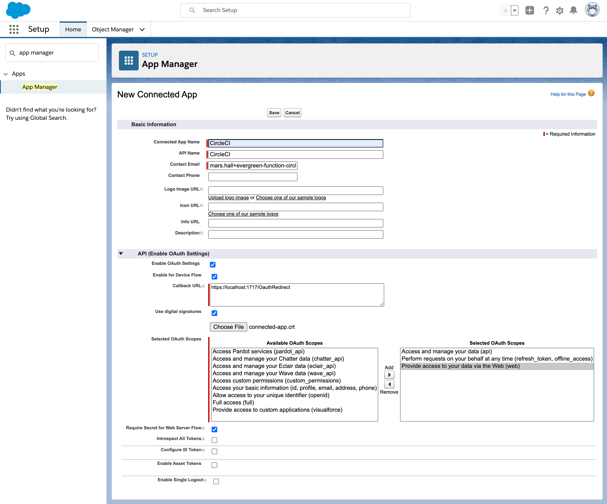

# Example of testing Evergreen functions with CircleCI

During the Functions Pilot, their continuous integration story will utilize CircleCI & GitHub. This repo is a working example to develop & test toward Pilot.

👓 For more context, see: [Functions Continuous Integration | Delivery PRD](https://salesforce.quip.com/cJASAvjPQV8k#WEBACAAqmIJ).


## Requirements

- a [GitHub account](https://github.com/join)
- a [CircleCI account](https://circleci.com/signup/) authenticated with the above GitHub account
- a Salesforce **Dev Hub** that `sfdx` will use for [scratch orgs](https://trailhead.salesforce.com/en/content/learn/modules/sfdx_app_dev/sfdx_app_dev_setup_dx#sfdx_app_dev_setup_dx_scratch_org_def)
  * [Sign-up for a Developer org](https://developer.salesforce.com/signup)
  * [Enable Dev Hub](https://developer.salesforce.com/docs/atlas.en-us.218.0.sfdx_setup.meta/sfdx_setup/sfdx_setup_enable_devhub.htm)
- an [sfdx project](https://developer.salesforce.com/docs/atlas.en-us.sfdx_dev.meta/sfdx_dev/sfdx_dev_ws_create_new.htm)
  * created with `sfdx force:project:create`
  * containing at least one Evergreen Function
    * with working tests via `npm test` (the default function includes a real unit test)
    * created with `sfdx evergreen:function:create` ([example default function](functions/ExampleFunction/))
  * pushed to a repo within the above GitHub account


## Setup

💻 *These instructions require a command shell such as **`bash` or `zsh` on Linux or macOS**, and may not be compatible with other operating systems.*

1. [create a certificate](#1-create-a-certificate) (public/private key pair) for CircleCI auth with Salesforce Dev Hub
1. [create a "CircleCI" Connected App](#2-create-a-circleci-connected-app) in your Salesforce DevHub
1. [add CircleCI config](#3-add-circleci-config) to your project
1. [create the CircleCI project](#4-create-circleci-project) for the GitHub repo
1. [start building](#5-start-building) 🏗


### 1. Create a certificate

Set the certificate to identify as “CircleCI”, but really the field contents of the cert do not matter. All Salesforce cares about is the cryptographic signing & verification enabled by the certificate pair.

In your command shell:

```bash
mkdir circleci-jwt-auth/ && cd circleci-jwt-auth/

export PASS="$(openssl rand -hex 20)"
openssl genrsa -des3 \
  -passout "pass:$PASS" \
  -out connected-app.pass.key \
  2048
openssl rsa -passin "pass:$PASS" \
  -in connected-app.pass.key \
  -out connected-app.key
rm connected-app.pass.key

openssl req -new \
  -key connected-app.key \
  -out connected-app.csr
openssl x509 -req -sha256 -days 365 \
  -in connected-app.csr \
  -signkey connected-app.key \
  -out connected-app.crt

base64 connected-app.key > connected-app.key.base64
```

🤐  These `.key` & `.key.base64` files contain secret data. Maybe you should **save them to a secure note, such as in LastPass**, but **do not commit them to version control**.


### 2. Create a "CircleCI" Connected App

Create a Connected App in the Salesforce Dev Hub that provides authentication for external services based on the new certificate.

In Salesforce **Setup** → **App Manager**, create a **New Connected App**, with the following **Name**, **Callback URL** and **Selected Oauth Scopes** set.

As the new Connected App's **Digital Signature file**, upload the file (created above) `circleci-jwt-auth/connected-app.crt`.



📝  Note the **Consumer Key** value of the Connected App for use later in CircleCI's `SFDX_CONSUMER_KEY` environment variable.

Then **Manage** that app to set **Permitted Users** and the **Profile** as follows:


### 3. Add CircleCI config

Copy [`.circleci/config.yml`](.circleci/config.yml) from this repo into your project, commit, & push to GitHub.


### 4. Create CircleCI project

Visit your [CircleCI **Projects**](https://app.circleci.com/projects/) dashboard to enable this project.

When enabling it, choose use your own existing `config.yml` and start building immediately. The first build will fail, because we need to setup the Connected App certificate/JWT auth ❌

Configure the CircleCI project to edit its **Environment Variables**. Set the following JWT auth environment variables:

  - **`SFDX_CONSUMER_KEY`** to the Consumer Key display in Salesforce Setup for the Connected App
  - **`SFDX_JWT_KEY`** to the contents of `circleci-jwt-auth/connected-app.key.base64`
  - **`SFDX_USERNAME`** the Salesforce username of a **System Administrator** (or whatever Profile you assigned to the Connected App).


### 5. Start Building

To start building, either click re-run in CircleCI web UI, or push new commits to the GitHub repo.

Now, assuming your tests work, the CircleCI job should be successful ✅

